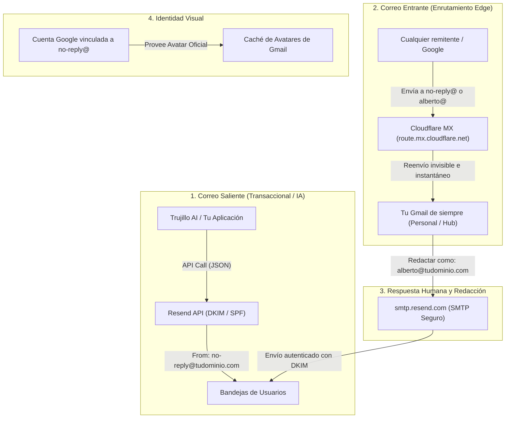

# Guía Maestra: Infraestructura de Correo Corporativo e Identidad de Marca para Startups e IA a Coste 0 €

> **Cómo montar el sistema de correo, identidad verificada y diseño minimalista OLED de alto contraste que usan las startups de referencia sin pagar los 15 €/mes por usuario de Google Workspace o Microsoft 365.**

---

## 1. El Mito de los 15 €/mes por Usuario

Cuando un emprendedor o desarrollador lanza un proyecto, una IA o una startup, el primer impulso suele ser contratar **Google Workspace** o **Microsoft 365** a razón de 6 € a 18 € por usuario al mes.

Para una empresa de 4 personas, esto supone entre **400 € y 1.000 € al año** solo para que los correos lleven `@miempresa.com`. Y peor aún: cada vez que el sistema necesita una dirección automatizada (`no-reply@`, `alertas@`, `soporte@`, `facturacion@`), muchas startups acaban pagando licencias redundantes por buzones que solo usa una máquina.

### El Secreto de las Startups Modernas (El Modelo JAMstack / Edge)
Las empresas tecnológicas de referencia (Stripe, Vercel, Supabase, Linear) no usan buzones tradicionales para sus aplicaciones. Separan con precisión milimétrica:
1. **El correo de máquina (Transaccional)**: Códigos de verificación, reportes diarios, alertas, facturas. Se emite desde el Edge con APIs de alta entregabilidad (Resend / AWS SES).
2. **El correo de recepción**: Enrutado en milisegundos desde los servidores DNS (Cloudflare Email Routing) hacia el buzón operativo del fundador.
3. **La identidad visual**: Vinculada en las capas de confianza de Google y Gravatar para lucir logotipos oficiales sin coste de suscripción.

---

## 2. Arquitectura General del Sistema



---

## 3. Fase 1: Dominio y Autenticación Criptográfica (SPF, DKIM, DMARC)

Para que ningún correo acabe en la carpeta de Spam, el dominio debe estar autenticado criptográficamente.

### 1.1. Configuración en Cloudflare DNS
En tu panel de DNS de Cloudflare, añade los registros que proporciona **Resend**:
- **DKIM (`TXT` o `CNAME`)**: Clave pública RSA de 2048 bits (`resend._domainkey.tudominio.com`).
- **SPF (`TXT`)**: Define qué servidores tienen autorización para emitir correo a nombre de tu dominio:
  ```dns
  v=spf1 include:_spf.mx.cloudflare.net include:amazonses.com ~all
  ```
- **DMARC (`TXT`)**: Política de seguridad en `_dmarc.tudominio.com`:
  ```dns
  v=DMARC1; p=none; rua=mailto:alberto@tudominio.com
  ```

---

## 4. Fase 2: Recepción y Enrutamiento Invisible (Cloudflare Email Routing)

En lugar de pagar buzones con almacenamiento POP3/IMAP, los correos entrantes se interceptan en los servidores de Cloudflare y se redirigen a tu Gmail personal.

### 4.1. Ventajas de Seguridad y Privacidad
- **Ocultamiento de tu identidad personal**: Nadie en internet puede ver tu cuenta `@gmail.com`. Los registros DNS solo muestran los servidores de Cloudflare (`route1.mx.cloudflare.net`).
- **Alias ilimitados**: Puedes crear tantas direcciones como quieras (`no-reply@`, `alberto@`, `legal@`, `socio@`, `billing@`) a coste 0 €.

### 4.2. Reglas de Enrutamiento
En **Cloudflare Dashboard &rarr; Email Routing &rarr; Routing Rules**:
1. `alberto@tudominio.com` &rarr; `forward: tu_gmail@gmail.com`
2. `no-reply@tudominio.com` &rarr; `forward: tu_gmail@gmail.com`
3. `catch-all` &rarr; `Action: Drop` (para bloquear correos a direcciones inexistentes).

---

## 5. Fase 3: La Foto de Perfil en Gmail sin Pagar Google Workspace

Gmail **no permite** que un correo incruste su propio avatar en el código HTML por razones de seguridad. En su lugar, consulta la base de datos de cuentas de Google.

### 5.1. El Método Gratuito en 2 Minutos
1. Entra a [accounts.google.com/signup](https://accounts.google.com/signup).
2. Pon como nombre: **Tu Marca** (ej. *Trujillo AI*).
3. En el campo de correo, selecciona **«Usar mi dirección de correo actual en su lugar»** (*Use my current email address instead*).
4. Escribe: `no-reply@tudominio.com` y pon una contraseña.
5. Google enviará un código de verificación de 6 dígitos a `no-reply@tudominio.com`.
6. Como Cloudflare lo reenvía a tu Gmail, abres tu Gmail, copias el código y lo introduces.
7. **Paso crítico**: Si Google te dice *"Add Gmail to your account / Añadir Gmail a tu cuenta"*, **no lo rellenes**. La cuenta ya está creada.
8. Ve a [myaccount.google.com](https://myaccount.google.com), haz clic en el círculo de la foto de perfil y sube tu avatar oficial (`avatar.png`).
9. En *Información personal &rarr; Foto de perfil*, asegúrate de que esté configurada como **Visible para: Cualquiera** (*Anyone*).

> [!TIP]
> **Para Apple Mail y otros clientes**: Regístrate en [gravatar.com](https://gravatar.com) con `no-reply@tudominio.com` y sube el mismo avatar. Clientes como Apple Mail y Thunderbird mostrarán la foto consultando Gravatar.

---

## 6. Fase 4: Enviar Correos desde tu Gmail como `alberto@tudominio.com` ("Enviar como")

Puedes redactar y responder correos desde tu interfaz habitual de Gmail figurando oficialmente como `alberto@tudominio.com`.

### 6.1. Configuración de Resend SMTP en Gmail
1. Abre tu Gmail &rarr; **Ajustes (Rueda dentada)** &rarr; **Ver todos los ajustes**.
2. Ve a la pestaña **Cuentas e importación**.
3. En la sección **«Enviar como»** (*Send mail as*), pulsa en **«Añadir otra dirección de correo electrónico»**.
4. Nombre: **Tu Nombre y Apellidos** (ej. *Alberto Trujillo*).
5. Dirección: **`alberto@tudominio.com`**.
6. Desmarca la casilla *"Tratar como un alias"* si quieres que figure como cuenta independiente.
7. En la siguiente pantalla, introduce los datos SMTP de Resend:
   - **Servidor SMTP**: `smtp.resend.com`
   - **Puerto**: `465` (con SSL) o `587` (con TLS)
   - **Nombre de usuario**: `resend`
   - **Contraseña**: Tu `re_xxxxxxxxx` (API Key de Resend)
8. Gmail enviará un código de verificación a `alberto@tudominio.com`, que entrará en tu bandeja. Lo confirmas y listo.

A partir de este momento, al pulsar **Redactar**, tendrás un desplegable en el campo `De:` para elegir si envías desde tu Gmail o desde tu dominio corporativo.

---

## 7. Fase 5: Sistema de Diseño de Correos Trujillo Minimalist (Monocromo de Alto Contraste)

Los correos infantiles con degradados pastel y botones inflados restan credibilidad técnica. El estándar Trujillo AI se basa en **minimalismo radical, contraste extremo y tipografía cuidada**:

### Principios de Diseño
- **Fondo Negro Puro (`#000000`)**: Cero saturación, compatible con pantallas OLED.
- **Bordes Milimétricos**: Separadores y contenedores con `border: 1px solid #1f1f1f;` o `#222222;`.
- **Cero Degradados de Colores**: El encabezado solo contiene el logotipo oficial (`28x28 px`) y el nombre en mayúsculas monoespaciadas (`font-family: ui-monospace, monospace; letter-spacing: 0.16em;`).
- **Botón de Acción Sólido Trujillo**: Píldora blanca pura con texto en negro azabache (`background: #ffffff; color: #000000; border-radius: 9999px; font-weight: 700;`).
- **Bloque de Código OTP / Códigos de Sesión**:
  ```html
  <table role="presentation" align="center" style="margin:24px auto 12px;max-width:380px;">
    <tr>
      <td bgcolor="#050505" style="border:1px solid #262626;border-radius:6px;padding:22px 28px;text-align:center;">
        <div style="font-family:ui-monospace,monospace;font-size:36px;font-weight:800;color:#ffffff;letter-spacing:14px;text-indent:14px;">
          ${otpCode}
        </div>
      </td>
    </tr>
  </table>
  ```
- **Sin Fugas de Datos**: Nunca imprimas IPs públicas de servidores ni volcados de depuración en los correos que reciben los usuarios.

---

## 8. Fase 6: Fechas Humanas y Reloj en Tiempo Real para IAs

Uno de los mayores fallos de las IAs es responder preguntas temporales con cadenas frías de base de datos (`2026-09-06T11:03:03.556Z` o `2026-09-06 13:01:12 (UTC+02:00)`).

### 8.1. Formateo en Español de España (`Europe/Madrid`)
Implementa en tu backend funciones que transformen los timestamps en lenguaje cotidiano:

```javascript
export function formatSpanishDateHuman(date, tz = 'Europe/Madrid') {
  const d = date instanceof Date && !isNaN(date.getTime()) ? date : new Date(date);
  const raw = new Intl.DateTimeFormat('es-ES', {
    weekday: 'long',
    day: 'numeric',
    month: 'long',
    year: 'numeric',
    timeZone: tz
  }).format(d);
  return raw.charAt(0).toUpperCase() + raw.slice(1);
  // Ejemplo: "Domingo, 6 de septiembre de 2026"
}

export function formatRelativeHuman(date, tz = 'Europe/Madrid', baseDate = new Date()) {
  const d = date instanceof Date && !isNaN(date.getTime()) ? date : new Date(date);
  const now = baseDate instanceof Date && !isNaN(baseDate.getTime()) ? baseDate : new Date();
  
  const dDay = new Intl.DateTimeFormat('en-CA', { timeZone: tz }).format(d);
  const nowDay = new Intl.DateTimeFormat('en-CA', { timeZone: tz }).format(now);
  const yDate = new Date(now.getTime() - 24 * 3600 * 1000);
  const yDay = new Intl.DateTimeFormat('en-CA', { timeZone: tz }).format(yDate);
  const timeStr = new Intl.DateTimeFormat('es-ES', { hour: '2-digit', minute: '2-digit', hour12: false, timeZone: tz }).format(d) + ' h';

  if (dDay === nowDay) return `Hoy a las ${timeStr}`;
  if (dDay === yDay) return `Ayer a las ${timeStr}`;
  return `${formatSpanishDateHuman(d, tz)}, ${timeStr}`;
}
```

### 8.2. Directiva del Prompt del Sistema (Anti-Alucinación)
Inyecta en el prompt del sistema la hora exacta y prohíbe explícitamente los formatos crudos:
```text
=== CONTEXTO TEMPORAL DEL SISTEMA EN TIEMPO REAL ===
- Fecha actual: Domingo, 6 de septiembre de 2026
- Hora actual: 15:30 h (Hora peninsular española / Madrid, UTC+2)
REGLA DE COMUNICACIÓN: Responde SIEMPRE en lenguaje humano, natural y elegante (ej. "Hoy es Domingo, 6 de septiembre de 2026, y son las 15:30 h"). Prohibido responder con volcados de base de datos como "2026-09-06".
```

---

## 9. Estrategia para Startups: El Truco de la Delegación y Relevo

### El Escenario Real:
1. Te das de alta en Claude, OpenAI, GitHub, AWS y Stripe usando:
   - `ai@tudominio.com`
   - `dev@tudominio.com`
   - `billing@tudominio.com`
2. Inicialmente, todas se reenvían a tu Gmail.
3. El día que contratas a un desarrollador, cambias en Cloudflare el reenvío de `dev@tudominio.com` a su correo. Él recibe los códigos de acceso y trabaja con normalidad.
4. El día que ese desarrollador sale de la empresa:
   - Reviertes la regla de Cloudflare a tu correo en 5 segundos.
   - Pides "Restablecer contraseña" en las plataformas: el correo te llega a ti.
   - **El empleado pierde el acceso y tu empresa conserva el 100% de la propiedad intelectual, modelos y proyectos.**

---

## 10. Resumen de Costes y Comparativa

| Concepto | Vía Tradicional (Google Workspace) | Vía Moderna (Cloudflare + Resend) |
| :--- | :--- | :--- |
| **Coste por usuario al mes** | 6 € a 18 € / mes | **0,00 €** |
| **Direcciones de máquina (`no-reply@`)** | Requiere licencia o configuración compleja | **0,00 € (Nativo)** |
| **Entregabilidad a bandeja de entrada** | Alta (IPs compartidas de Google) | **Máxima (Resend API con DKIM propio)** |
| **Diseño y plantillas** | Difícil de personalizar en HTML oscuro | **Control total del HTML/CSS en el Edge** |
| **Migración o relevo de empleados** | Lento y con costes de baja | **Instantáneo en Cloudflare DNS** |

---
*Documento preparado y verificado para su publicación en el portal de guías de `trujillomingorance.com`.*
