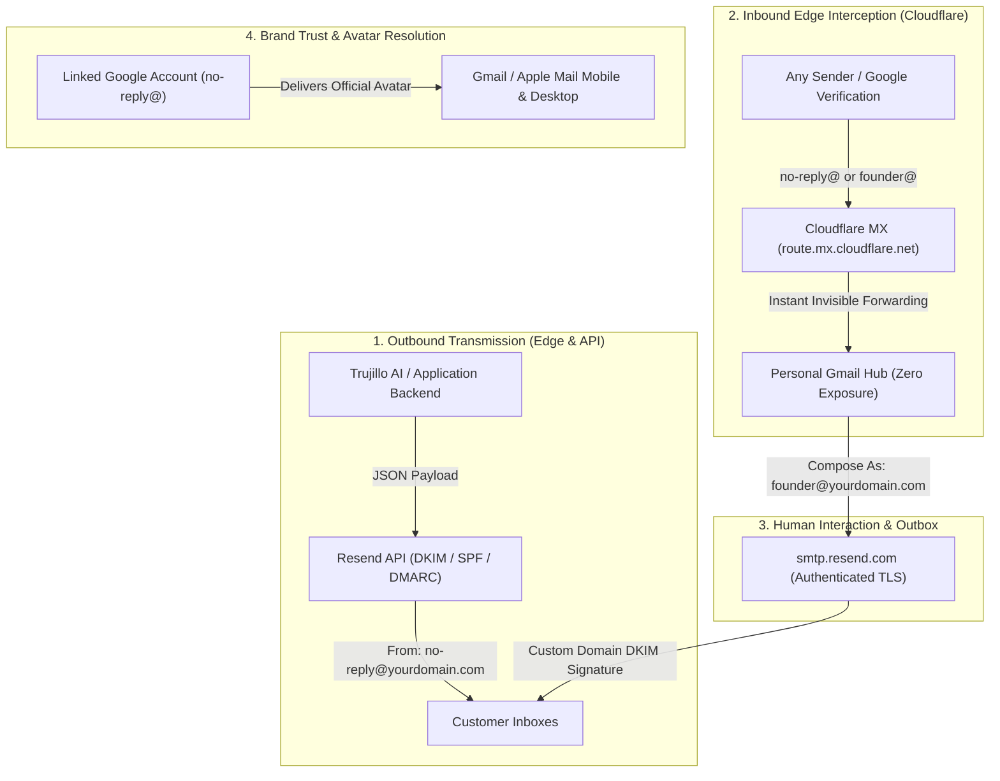

# The Zero-Cost Enterprise Email Architecture for AI Startups

> **How modern founders build production transactional infrastructure, verified Google brand avatars, and high-contrast OLED dark aesthetics without paying $15/user/month for legacy corporate suites.**

---

## 1. The $15/User/Month Fallacy

When founders launch an AI product or SaaS, the conventional reflex is to immediately subscribe to **Google Workspace** or **Microsoft 365** at $6 to $18 per user every month.

For a lean 4-person team, that burns **$500 to $1,000 annually** before generating a single dollar of revenue. Worse, when the system needs automated mailboxes (`no-reply@`, `ops@`, `alerts@`, `support@`), teams wastefully spin up full paid seats for accounts that will never be touched by a human.

### The Modern Cloudflare + Resend Architecture
Silicon Valley startups (Stripe, Vercel, Supabase, Linear) treat email as programmable infrastructure:
1. **Machine & Transactional Email**: One-time authentication codes, daily ops reports, alerts, telemetry. Sent from the Edge using high-deliverability APIs with custom cryptographic signatures (Resend / AWS SES).
2. **Inbound Edge Routing**: Intercepted directly at the DNS level (Cloudflare Email Routing) and seamlessly forwarded to the founder’s primary inbox at zero cost.
3. **Verified Brand Identity**: Associated with Google’s directory and Gravatar to render crisp, verified profile avatars inside Gmail and Apple Mail with zero recurring seat licenses.
4. **Interactive Human Replies**: Configured via Gmail’s native *Send Mail As* engine through authenticated TLS SMTP, giving the founder a dropdown to reply directly from their custom domain.

---

## 2. System Architecture



---

## 3. Cryptographic Deliverability: SPF, DKIM, and DMARC

To guarantee that transactional emails hit the primary inbox rather than Spam, your domain must carry rigorous cryptographic proofs.

### 3.1. Cloudflare DNS Configuration
Add the records provided by **Resend** to your Cloudflare DNS zone:

- **DKIM (`TXT` or `CNAME`)**: 2048-bit RSA public key (`resend._domainkey.yourdomain.com`).
- **SPF (`TXT`)**: Explicitly authorizes Cloudflare and Resend mail servers to transmit on behalf of your domain:
  ```dns
  v=spf1 include:_spf.mx.cloudflare.net include:amazonses.com ~all
  ```
- **DMARC (`TXT`)**: Security policy published at `_dmarc.yourdomain.com`:
  ```dns
  v=DMARC1; p=none; rua=mailto:founder@yourdomain.com
  ```

---

## 4. Inbound Edge Interception (Cloudflare Email Routing)

Instead of maintaining expensive POP3/IMAP storage, inbound emails are captured at Cloudflare's global edge network and redirected to your operating Gmail address.

### 4.1. Core Advantages
- **Complete Anonymity**: External users only see your custom domain. Your private Gmail hub is never disclosed in public DNS records.
- **Infinite Free Aliases**: Spin up `no-reply@`, `founder@`, `legal@`, `support@`, `billing@`, or `investors@` in seconds.

### 4.2. Rule Implementation
Inside **Cloudflare Dashboard &rarr; Email Routing &rarr; Routing Rules**:
1. `founder@yourdomain.com` &rarr; `forward: your_personal_hub@gmail.com`
2. `no-reply@yourdomain.com` &rarr; `forward: your_personal_hub@gmail.com`
3. `catch-all` &rarr; `Action: Drop` (rejects junk and unmapped addresses).

---

## 5. Bypassing Google Workspace: Verified Avatars in Gmail

Gmail strictly blocks emails from embedding their own profile pictures inside HTML code for anti-phishing protection. Gmail resolves sender avatars exclusively against Google’s user database.

### 5.1. The 2-Minute Setup
1. Open [accounts.google.com/signup](https://accounts.google.com/signup) in an incognito window.
2. Set the Name: **Your Brand** (e.g., *Trujillo AI*).
3. Under the email prompt, click **"Use my current email address instead"**.
4. Enter: `no-reply@yourdomain.com` and specify a master password.
5. Google dispatches a 6-digit verification code to `no-reply@yourdomain.com`.
6. Because Cloudflare forwards it to your Gmail hub, open your Gmail, retrieve the code, and confirm.
7. **Crucial**: If Google prompts *"Add Gmail to your account"*, **cancel or close that prompt**. Your Google Account is already created.
8. Navigate to [myaccount.google.com](https://myaccount.google.com), click the profile circle, and upload your official logo (`avatar.png`).
9. Under *Personal Info &rarr; Profile Picture*, verify visibility is set to **"Anyone"**.

> [!TIP]
> **Universal Compatibility (Apple Mail & Thunderbird)**: Register `no-reply@yourdomain.com` on [gravatar.com](https://gravatar.com) and upload the same asset. Apple Mail and third-party mail clients query Gravatar to display the sender icon automatically.

---

## 6. The "Send Mail As" Pipeline (Replying via Resend SMTP)

You can draft, send, and reply to emails directly from your standard Gmail web and mobile apps appearing officially as `founder@yourdomain.com`.

### 6.1. Resend SMTP Integration
1. Open Gmail &rarr; **Settings** &rarr; **See all settings**.
2. Navigate to the **Accounts and Import** tab.
3. In the **"Send mail as"** section, click **"Add another email address"**.
4. Display Name: **Your Name** (e.g., *Alberto Trujillo*).
5. Email address: `founder@yourdomain.com`.
6. Uncheck *"Treat as an alias"* for standalone corporate behavior.
7. Fill in the Resend SMTP credentials:
   - **SMTP Server**: `smtp.resend.com`
   - **Port**: `465` (SSL) or `587` (TLS)
   - **Username**: `resend`
   - **Password**: Your Resend API Key (`re_xxxxxxxxxxxxxx`)
8. Gmail sends a verification code to `founder@yourdomain.com`. Confirm it from your inbox.

You now have an instant dropdown in Gmail’s **Compose** window to toggle between your personal Gmail address and your corporate domain.

---

## 7. The Trujillo Minimalist Email Design System

Modern technical users reject colorful gradients, bubbly cartoon badges, and cluttered templates. The Trujillo AI standard emphasizes **pitch black `#000000` backgrounds, high contrast, clean monospace metadata, and brutalist elegance**:

### Core Design Rules
- **Pure Black Canvas (`#000000`)**: Deep OLED-compatible dark mode with zero color wash.
- **Subtle 1px Borders**: Hairline containers using `#1f1f1f` or `#222222`.
- **Zero Pastel Gradients**: Clean headers featuring a 28x28 px logo and uppercase monospaced branding (`TRUJILLO AI`).
- **High-Impact OTP Authentication Block**:
  ```html
  <table role="presentation" align="center" style="margin:24px auto 14px;max-width:380px;">
    <tr>
      <td bgcolor="#050505" style="border:1px solid #262626;border-radius:6px;padding:22px 28px;text-align:center;">
        <div style="font-family:ui-monospace,monospace;font-size:36px;font-weight:800;color:#ffffff;letter-spacing:14px;text-indent:14px;">
          ${otpDigits}
        </div>
      </td>
    </tr>
  </table>
  ```
- **The Trujillo Solid Pill Button**:
  ```html
  <a href="${url}" style="display:inline-block;padding:12px 28px;background:#ffffff;color:#000000;font-family:-apple-system,BlinkMacSystemFont,'Segoe UI',Roboto,sans-serif;font-size:13px;font-weight:700;text-decoration:none;border-radius:9999px;">
    Open Workspace &rarr;
  </a>
  ```
- **Zero Internal Data Leaks**: Never print backend server IPs or unformatted database timestamps in customer-facing emails.

---

## 8. Real-Time Temporal Grounding for AI Models

A common defect in LLM interfaces is outputting raw database timestamps (e.g., `2026-09-06T11:03:03.556Z` or `2026-09-06 13:01:12 (UTC+02:00)`). Humans communicate in natural, conversational date formats.

### 8.1. Conversational Date Helpers
```javascript
export function formatHumanDate(date, tz = 'Europe/Madrid') {
  const d = date instanceof Date && !isNaN(date.getTime()) ? date : new Date(date);
  return new Intl.DateTimeFormat('en-US', {
    weekday: 'long',
    month: 'long',
    day: 'numeric',
    year: 'numeric',
    timeZone: tz
  }).format(d);
  // Returns: "Sunday, September 6, 2026"
}

export function formatRelativeHuman(date, tz = 'Europe/Madrid', baseDate = new Date()) {
  const d = date instanceof Date && !isNaN(date.getTime()) ? date : new Date(date);
  const now = baseDate instanceof Date && !isNaN(baseDate.getTime()) ? baseDate : new Date();

  const dDay = new Intl.DateTimeFormat('en-CA', { timeZone: tz }).format(d);
  const nowDay = new Intl.DateTimeFormat('en-CA', { timeZone: tz }).format(now);
  const timeStr = new Intl.DateTimeFormat('en-US', { hour: '2-digit', minute: '2-digit', hour12: true, timeZone: tz }).format(d);

  if (dDay === nowDay) return `Today at ${timeStr}`;
  return `${formatHumanDate(d, tz)} at ${timeStr}`;
}
```

### 8.2. System Prompt Grounding Directive
```text
=== REAL-TIME SYSTEM CLOCK CONTEXT ===
- Current Date: Sunday, September 6, 2026
- Exact Time: 1:30 PM (Madrid / Europe/Madrid, UTC+2)
COMMUNICATION DIRECTIVE: Always respond to time queries in natural, conversational prose (e.g., "Today is Sunday, September 6, 2026, and the time is 1:30 PM"). Raw ISO database strings (e.g., "2026-09-06") are strictly forbidden.
```

---

## 9. Founder Playbook: Instant Employee Onboarding & Offboarding

### The Real-World Scenario:
1. Register company tools (Claude, OpenAI, GitHub, AWS, Stripe) under dedicated corporate aliases:
   - `ai@yourdomain.com`
   - `dev@yourdomain.com`
   - `billing@yourdomain.com`
2. Initially, all aliases route seamlessly into your personal Gmail hub.
3. When hiring a lead developer, switch the Cloudflare routing destination for `dev@yourdomain.com` to their Gmail address in 5 seconds. They receive verification links and access tools autonomously.
4. When that developer leaves:
   - Revert the Cloudflare rule back to your inbox in 5 seconds.
   - Click "Forgot Password" on the relevant service. The reset link arrives in your inbox.
   - **Access is revoked instantly, and the company retains 100% ownership of the accounts, history, and IP.**

---

## 10. Cost & Capability Matrix

| Dimension | Legacy Route (Google Workspace) | Modern Route (Cloudflare + Resend) |
| :--- | :--- | :--- |
| **Monthly Cost Per User** | $6.00 to $18.00 / month | **$0.00** |
| **Service & Machine Mailboxes (`no-reply@`)** | Paid seat or complex alias mapping | **$0.00 (Native)** |
| **Outbound Deliverability** | Shared Google Workspace pool | **Dedicated DKIM via Resend Edge** |
| **Template Customization** | Restricted HTML support | **Complete CSS/HTML control in Worker** |
| **Employee Offboarding** | Manual account suspension & seat billing | **Instant 1-click DNS reroute** |
| **Brand Avatar Verification** | Automatic only within Workspace domain | **Global via linked Google ID & Gravatar** |

---
*Published by Trujillo AI Engineering. Canonical resource maintained for `trujillomingorance.com`.*
